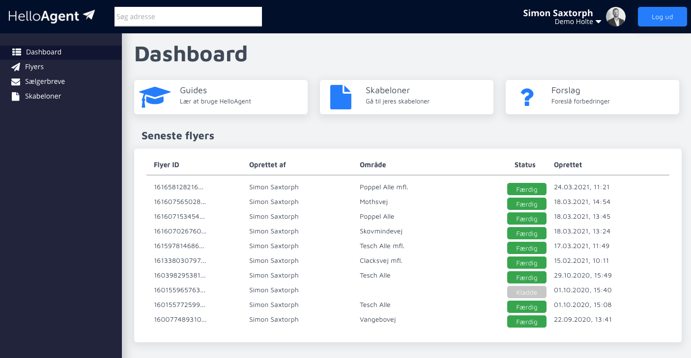

# Hvad er HelloAgent

**HelloAgent** er en platform hvor du kan søge efter ejendomme og lave personlig målrettet markedsføring til den enkelte boligejer.

Vi hjælper bl.a. ejendomsmæglere med at indsamlet og benytte data om boliger i Danmark. Vores platform er udviklet til at kunne blive brugt af organisationer med mange forretninger, små teams eller enkelte personer.Vi arbejder på højtryk på at lave en overordnet dokumentation så I hurtigt kan komme igang.&#x20;

I menuen til venstre finder I en guide til hvordan I bedst bruger flettekoder i jeres breve. Der vil løbende blive opdateret og tilføjet artikler, så vend gerne tilbage igen senere.

Har I brug for hjælp er I altid velkommen til at sende os en besked via supporten fra appen eller skrive os en mail.


[start.md](kom-igang/start.md)


## Hvad kan HelloAgent?

Vores platform er udviklet som en self-service platform hvor man har overblik over genererede flyers, skabeloner og automatiserede udsendelser af f.eks. sælgerbreve.

## Skabeloner

I platformen har man et område hvor man kan lægge _skabeloner_ op. Skabeloner er filer i f.eks. word eller powerpoint-format som indeholder jeres design og tekster.

Skabelonerne kan derved genbruges til at lave breve og flyers flere gange, og alle på kontoret har altid adgang til de nyeste filer.

.png>)

