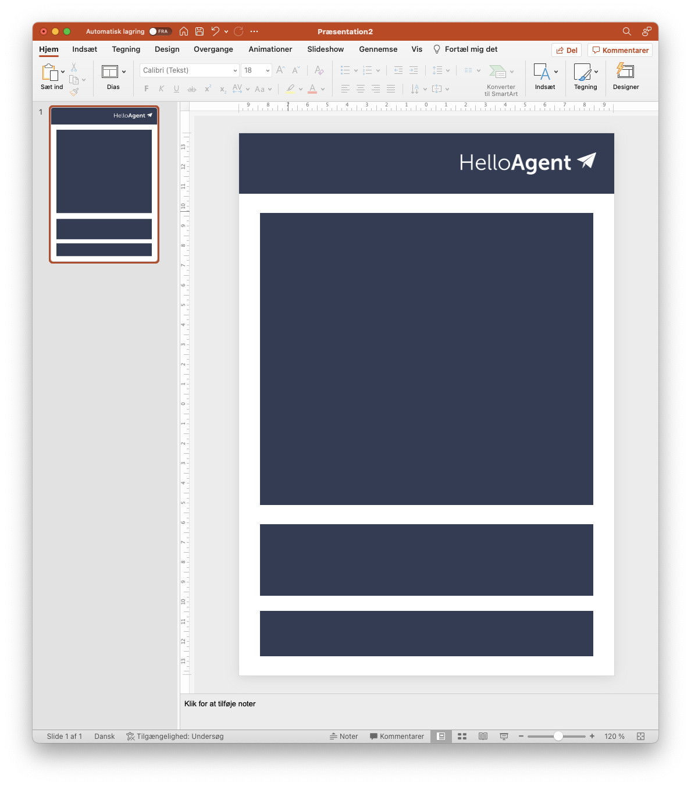

# Begynd at designe

Inden du begynder på _selve_ designet, er det selvfølgelig en god idé at have en nogenlunde fornemmelse af, hvordan det skal ende med at se ud.

Måske har I en _brand guide_ i forvejen der dikterer logo, farver og fonte, eller måske har I eksisterende breve og flyers som I vil "konvertere" til at fungerer i HelloAgent.


Kommer du fra en kæde så har I formentlig en brand guide der beskriver hvordan farver, logo med videre skal placeres på siden. Spørg gerne om hjælp fra os!


Mangler du ideer til designs kan du se på sider som [https://www.canva.com/templates/](https://www.canva.com/templates/) som har massere af gratis inspiration du kan starte med.

### De første elementer

Start med de store elementer og brug _figurer under "indsæt -> figurer"_ til at lave omrids af hvordan siden skal ende med at se ud. Herunder er indsat 4 firkanter og et logo. Læg mærke til at afstanden er ens imellem alle elementer - det gør det balanceret for modtageren.

<figure><figcaption>
Et design inden der er stylet
</figcaption></figure>

