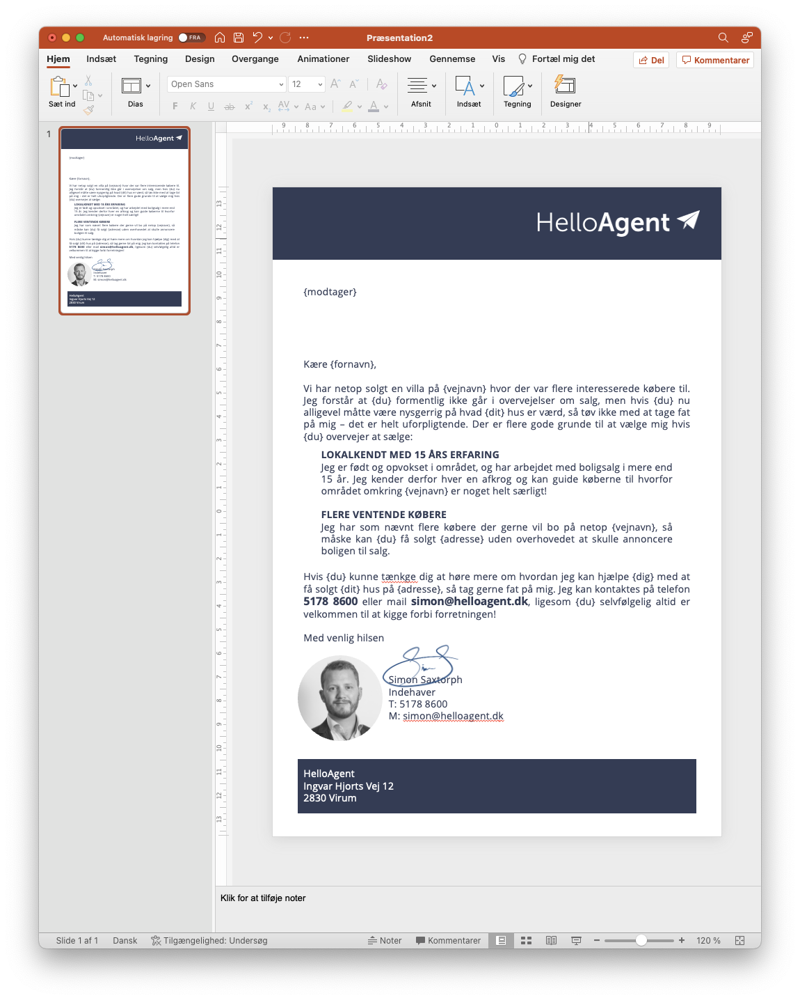

# Begynd på teksten

I nedenstående eksempel er brevet tænkt som et _personligt_ brev der sendes ud på en vej hvor vi netop har solgt et hus. Fremfor en lidt mere generisk tilgang hvor man sender en flyer med et billede af et hus der er solgt,  kan det ofte være værd at prøve med den personlige vinkel i stedet.

<figure><figcaption>
Begyndelse på en tekst til et nabobrev
</figcaption></figure>

### Flettefelter

I eksemplet ovenfor er der skrevet flettekoder ind - alt det som står i tuborg-klammer, såsom **{vejnavn}.** Den generelle hovedregel er, at alle flettekoder skrives i _ental_ (dvs. **{du}**, **{din}** osv.). Der er en særlig flettekode til modtagerfeltet som blot er **{modtager}**, og som udfylder alle nødvendige informationer.

Der skal benyttes nogle bestemte flettekoder, man kan ikke lave sine egne (endnu), men du kan læse mere under [Broken link](broken-reference "mention")

