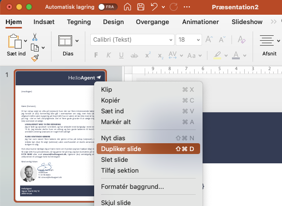
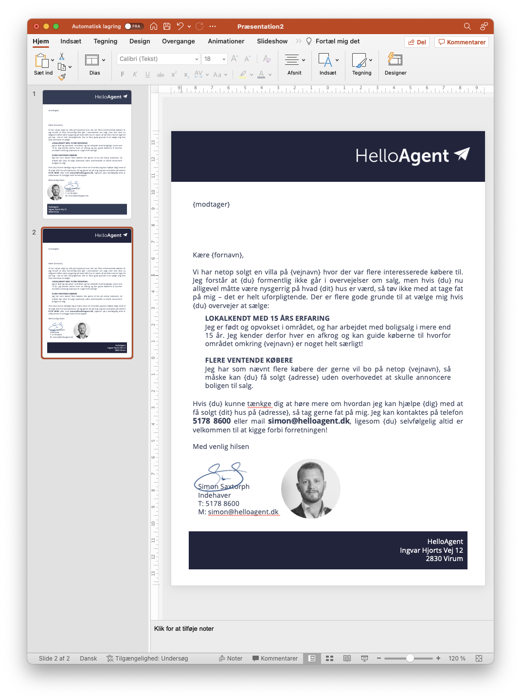
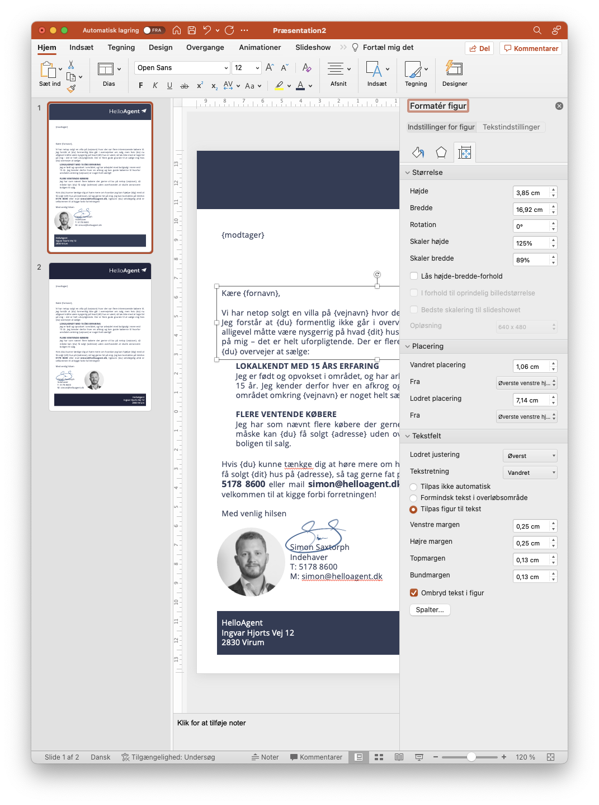
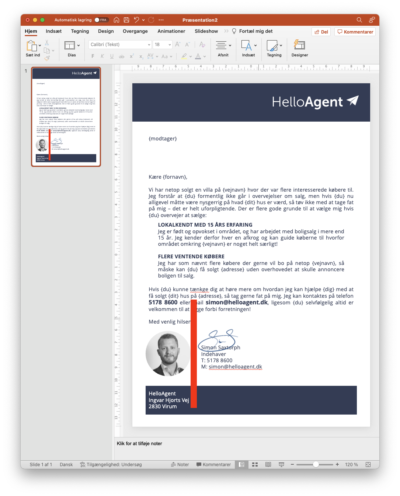

# Diverse tips

### "CTA" - Call to action&#x20;

I alle breve, flyers og lignende er det enormt vigtigt at der er et klart og fremhævet "Call to Action".

Det kan være i en boks, som fremhævet/fed tekst som ovenstående eksempel eller noget helt tredje - det vigtigste er blot, at modtageren ikke må være i tvivl om hvordan de tager handling på brevet.


Jeres CTA er det måske vigtigste punkt - uden et call to action skal modtageren bruge unødig tid og energi på at funde ud af hvordan de skal kontakte jer, og det skaber lavere konvertering.


### Test flere versioner i samme fil

Vi anbefaler som nævnt at benytte powerpoint som udgangspunkt, da det kan være lettest at styre ens designs her.

En anden fordel ved powerpoint er, at man nemt og hurtigt kan lave flere designs i samme fil, for på den måde hurtigere at kunne teste forskellige farver, fonte og opsætninger ud.


Højreklik på siden og vælg "Dupliker side"


Herefter kan du fx. prøve at ændre farver eller opsætning for at se hvad der fungerer bedst.

<figure><figcaption>
En duplikeret side med en lidt anden opsætning
</figcaption></figure>

### Bliv gode venner med "Formatér figur"

Det kan være svært at lave den sidste finjustering i hånden, fx. kan det hurtigt drille at hvis man vil flytte et element et par milimeter til den ene side, eller skal lave andre små justeringer.

Det kan derfor godt betale sig at bruge lidt tid på at lære feltet "Formatér figur" som kommer ved at højreklikke på et element og vælge menupunktet.

#### Indstillinger for figur

Benyt denne til at indstille farver, størrelse og præcis placering på siden.

<figure><figcaption></figcaption></figure>

#### Tekstindstillinger

Under "Tekstindstillinger" kan man tilpasse hvordan tekst _inde i_ figuren skal opføre sig. Her kan man sætte marginer (afstandende til selve figure) med mere. For de fleste elementer med tekst giver det mening at have "Tilpas figur til tekst" og "ombryd tekst i figur", men leg gerne med indstillingerne og spørg endelig til råds.

<figure><figcaption></figcaption></figure>

### Lav en "hjælpe" figur til at indstille afstande

Hvis man har lidt vanskeligheder med at få afstandende mellem elementer til at spille, så kan man lave en midlertidig hjælpefigur - typisk en firkant - der har det mål man gerne vil ramme (fx. 1 cm).&#x20;

Hjælperen kan man snappe op ad det element man vil skabe en bestemt afstand til, hvorefter det er nemt at indstille andre elementers afstand. Samme resultat kan man få ved at bruge marginer.

Hjælperen sletter du selvfølgelig blot når du ikke skal bruge den længere.

<figure><figcaption>
En hjælper på 0,5 cm til at indstille afstand mellem billede og navn/signatur
</figcaption></figure>
