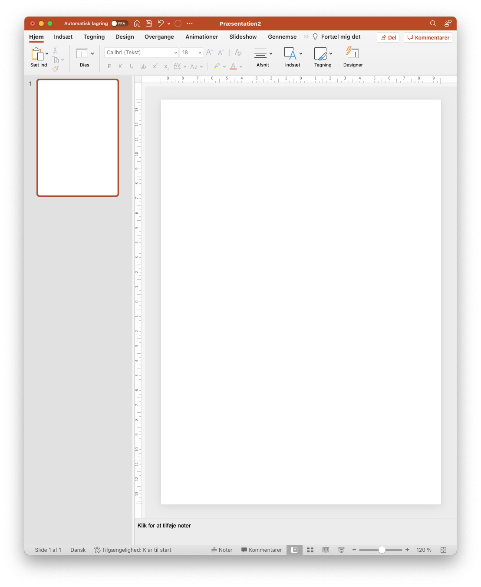

# Sådan starter du

Kernen i HelloAgent er vores smarte skabeloner som gør det muligt at lave hyper personlige breve og flyers til boligejere i hele Danmark. Skabelonerne er endda så smarte, at det er muligt for jer at lave jeres helt egne.&#x20;

Det betyder at I kan lave designs fuldstændig som I vil have det!&#x20;

## :sparkles: Filer

Vores skabeloner tager udgangspunkt i helt almindelige word og powerpoint filer. Disse formater er valgt da der er vidt tilgængelige, og langt de fleste kan finde ud af at benytte dem.

> _Men vent, man kan da ikke lave pæn grafik i word eller powerpont!?_\
> _- grafikeren_

Jo, det kan man faktisk godt. Måske kan man ikke lave grafik egenet til bladproduktion, men til flyers og breve opfylder de faktisk fint de behov man har, og vi har masser af eksempler der kan bruges til inspiration.

Generelt anbefaler vi at benytte _powerpoint_ da det her er nemmest at styre hvordan billeder og tekstbokse. Men, skal I sende et regulært brev med meget tekst, så vælg endelig word.


Tænker over hvordan slutproduktet skal se ud. Hvis det "ligner" et brev med modtagerfelt, en masse tekst og afsender, så brug word. Ellers brug powerpoint.


Når du har oprettet en tom fil skal sidestørrelsen tilpasses til det format du ønsker den skal have når du printer, typisk A4. Word er automatisk A4, i powerpoint vælger du filer -> sideopsætning og skriv 21 cm ud for bredde og 29,7 cm ud for højde.

Nu kan du designe flyeren fuldstændig som du ønsker det med billeder, overskrifter med mere.

<figure><figcaption>
Sådan ser en powerpoint ud når sidestørrelsen er ændret til A4 format
</figcaption></figure>

Du er nu klar til næste skridt, nemlig at påbegynde dit design.
