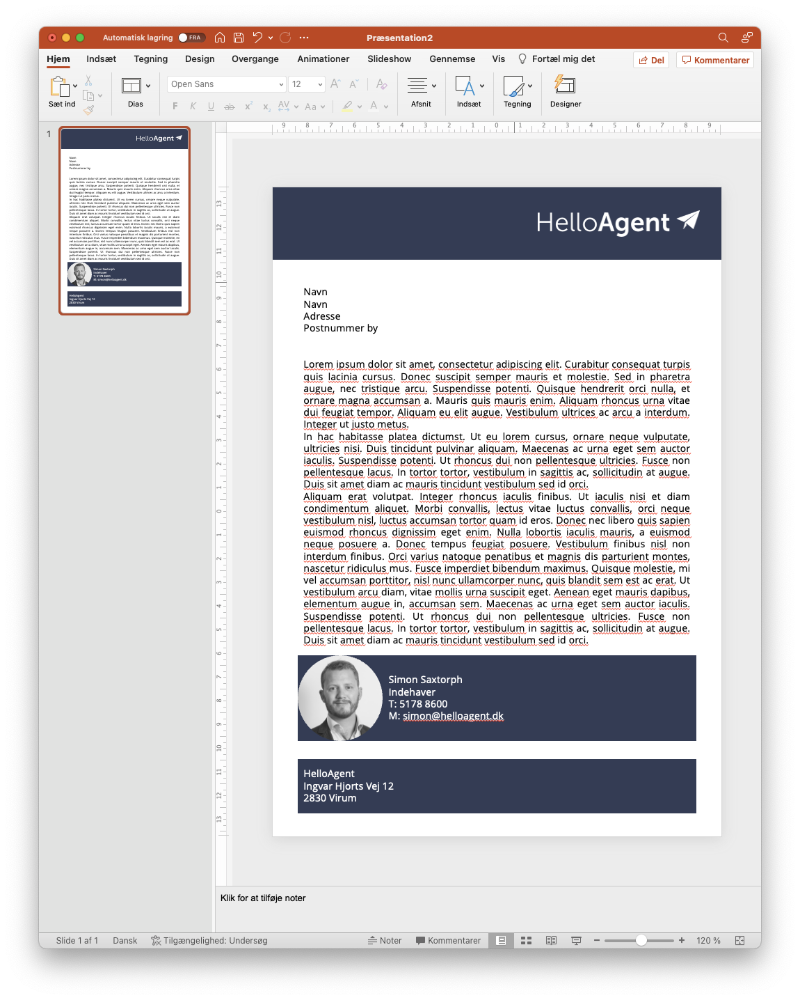
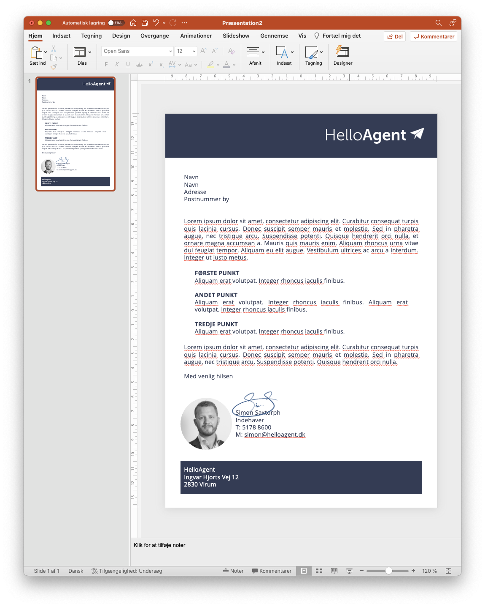

# Tilføj detaljer

Du kan nu erstatte elementerne en efter ind med billeder, tekst osv. Nedenfor er designet rimelig simpelt med et stort tekstfelt, afsenderinformation samt en bund med virksomhedsinformation.

<figure><figcaption>
Process med at udskifte figurelementer med de endelige elementer
</figcaption></figure>

I dette eksempel er vi begyndt at erstatte fyldteksten så det ligner den opsætning vi gerne vil ramme, og farven på fonten er givet en lidt mindre sort farve så den ikke er så hård at se på.&#x20;

&#x20;Bemærk også at der har indsæt signatur for et mere personligt udtryk - generelt anbefaler vi dog at der underskrives i hånden når det kan lade sig gøre.

Da dette brev skal beskrive nogle af de ting vi er gode til, benytter vi en punktopstilling så modtageren hurtigt kan scanne brevet for de vigtigste oplysninger.

<figure><figcaption>
Flere detaljer i tekst og afsender
</figcaption></figure>

