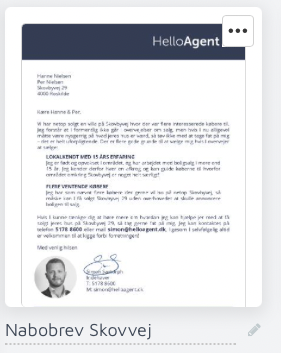
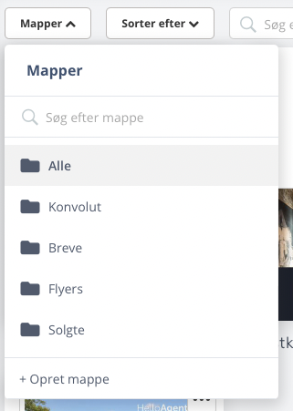
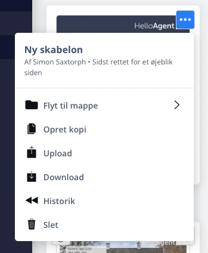
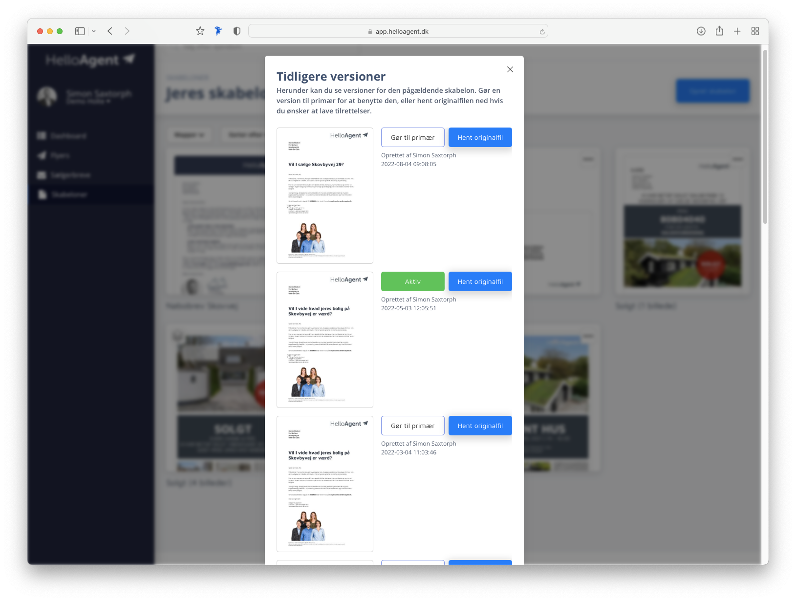

# Organisering

### Navngiv skabeloner

Først, og måske ikke så overraskende, giver det nemmere overblik at I navngiver jeres skabeloner.

Tryk på navnet ud for "kuglepennen" og giv skabelonen et nyt navn.

<figure><figcaption>
Navngiv jeres flyer
</figcaption></figure>

### Organiser i mappe

Læg skabeloner i mapper med logiske navne såsom "solgt", "nyhed", "nabobrev" osv.

Opret nye mappe ved at trykke på "Mapper" og vælg "Opret mappe" og navngiv den nye mappe.

Trykker du på en af mapperne i oversigten så vil du blive vist de skabeloner der ligger i den pågældende mappe.

#### Læg skabelonen i mappe

Tryk på de action-menuen (de tre prikker) på skabelonen og vælg "Flyt til mappe".

### Lav versioner i stedet for "Nye skabeloner"

Hvis I laver en mindre ændring i en skabelon, fx. laver ny overskrift eller skifter et billede, så behøver I ikke lave en _ny_ skabelon.

I stedet kan I oprette en version under den eksisterende skabelon.&#x20;

Fordelen er, at I stedet for at ende med mange enslignede skabeloner som roder i oversigten, så har hver skabelon en historik tilknyttet.


En skabelon kan ses som et "overordnet design" og en version som en bestemt udgave af det design.


#### Upload en ny version

For at uploade en ny _version_ klikker man på action-menuen på en skabelon og trykker upload og vælger den tilpassede fil.

Herefter generes et nyt preview med den nye version, som automatisk bliver gjort til den "Aktive" version.


Uploader du en ny version, bliver den automatisk gjort aktiv


#### Historik

Versioner ville ikke være ret brugbare, hvis ikke man kunne gå tilbage i tid. Ved at trykke på action-menuen og trykker "Historik" kan man se alle tidligere versioner af den pågældende skabelon. Man kan også _skifte tilbage_ til en tidligere version hvis man fx. har lavet en fejl i den senest hentede version.

Sidst, men ikke mindst, kan man altid downloade originalfilen af en version hvis der er en bestemt version man vil lave ændringer i.


For nuværende kan man ikke _slette_ versioner, men man kan slette selve skabelonen.


<figure><figcaption>
Oversigt over versioner af en bestemt skabelon
</figcaption></figure>

