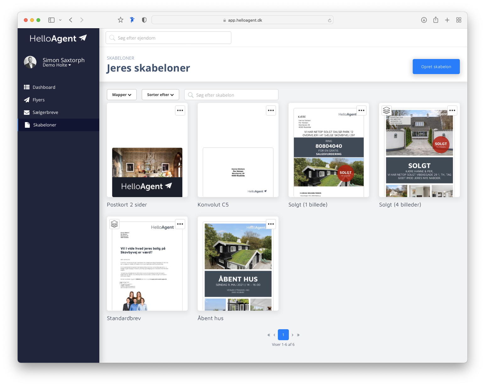

# Upload af skabeloner

### Log ind på app.helloagent.dk

Først skal du sikre dig at du har en bruger og er tilknyttet en butik.

Når du logger ind kan du i menuen til venstre vælge punktet "Skabeloner". Her kan du se alle butikkens nuværende skabeloner.

<figure><figcaption>
Forretningens skabeloner
</figcaption></figure>

Tryk "Opret skabelon" øverst til højre - nu kan du enten drag-and-droppe eller klikke og vælge din fil der hvor du har gemt.

<figure><figcaption>
Uploadfelt
</figcaption></figure>


Bemærk at der pt. er en maksimal størrelse på 5 mb. Det er for at den færdige fil ikke bliver for stor til at den kan håndteres af fx. jeres printer. Vi forsøger at komprimere siderne så godt som muligt, og ændrer muligvis grænsen på et tidspunkt.


#### Preview genereres

Systemet vil nu generere et preview med testdata, og efter små 10 sekunder kan du se et færdigt eksempel af dit brev som det vil komme til at se ud.


Klik på selve billedet for at se en stor udgave

